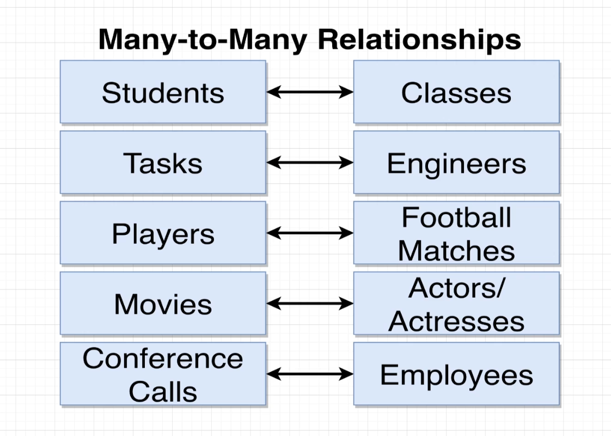

## SQL & POSTGRESQL


---

### `01` - SQL Statement

1. **`Database Design`**


2. **`Create Table`**

```sql
CREATE TABLE cities (
    name VARCHAR(50),
    country VARCHAR(255),
    population INTEGER,
    area INTEGER
);
```

- Analyzing `Create table`


3. **`Insert Data`**

```sql
INSERT INTO cities (name, country, population, area) 
VALUES 
    ('TP.Ho Chi Minh', 'Viet Nam', 985555, 454),
    ('Tokyo', 'Japan', 986564, 653),
    ('London', 'England', 65987, 124);
```

4. **`Retrieving data with Select`**

- **Select all**:

```sql
SELECT * FROM cities;
```

- **Select some field**:

```sql
SELECT name, country FROM cities;
```


5. **`Calculated Column in SQL`**

- **Calculator in SQL** with **Select**:

```sql
SELECT name, population / area AS density FROM cities;
-- return column `name` and `density`, `density` you calculator from `population` and `area`
```

- **Math operator**:


---

### `02` - Filtering Record

1. **`Filter record with WHERE`**

```sql
SELECT name, country FROM cities WHERE area > 4000;
```


2. **`More WHERE`**


```sql
SELECT name, country FROM cities WHERE area = 8563;
-- or
SELECT name, country FROM cities WHERE area <> 4000;
-- or
SELECT * FROM cities WHERE area NOT IN (4000, 5000, 8000);
```

3. **`Compound WHERE clauses`** (`Mệnh đề ghép WHERE`)

```sql
SELECT name, country FROM cities WHERE area > 4000 AND (name = 'TP.Ho Chi Minh' OR name = 'Delhi');
```

4. **`Calculation with WHERE`**

```sql
SELECT name, country FROM cities WHERE population / area > 6000;
```

5. **`Update data`**

- **Update a field**:

```sql
UPDATE cities SET name = 'Ha Noi' WHERE name = 'TP.Ho Chi Minh';
```

- **Update many field**:

```sql
UPDATE cities SET name = 'Ha Noi', area = 2000 WHERE name = 'TP. Ho Chi Minh';
```

6. **`Delete data`**

- **Delete a specific row**:

```sql
DELETE FROM cities WHERE name = 'Tokyo';
```

- **Delete many rows**: (`it works with IN`)

```sql
DELETE FROM cities WHERE name IN ('Ha Noi', 'Tokyo', 'Delhi');
```

- **Delete all**:

```sql
DELETE FROM cities;
```

---

### `03` - Working Table (DB Design, Relationship,...)

1. **`One to Many - Many to One`** relationship


2. **`One to One`** relationship


3. **`Many to Many`** relationship



4. **`Understand Primary Key & Foreign Key`**


5. **`Create Foreign key`**

- You need to provide **foreign key** id you want.

- Create table with **foreign key**

```sql
CREATE TABLE photos (
    id INTEGER PRIMARY KEY,
    url VARCHAR,
    user_id INTEGER REFERENCES users(id) -- this is syntax define foreign key
);
```

- Insert data with **foreign key** you define.

```sql
INSERT INTO photos (url, user_id)
VALUES 
    ('https://photo.com', 2);
```

6. **User `Join statement` to get detail data associate**

- You can use `Join statement` to get data from **foreign key**.

```sql
SELECT url, username FROM photos
JOIN users ON users.id = photos.user_id;
```

7. **Constraint around Deletion**


- **Default**: `ON DELETE RESTRICT`

- **ON DELETE CASECADE** is good solution to delete all data associate `foreign key`.

- You can add `these option delete` when creation table.

```sql
CREATE TABLE photos (
    id INTEGER NOT NULL PRIMARY KEY,
    url VARCHAR,
    user_id INTEGER REFERENCES users(id) ON DELETE CASECADE
);

DELETE FROM users WHERE id = 1;
```

- When you delete an user by id with option `ON DELETE CADESE` in photos table, these photo have `foreign key` equal user id will delete.

8. **Set NULL foreign key when deleted**

- You can use option delete `ON DELETE SET NULL`.

```sql
CREATE TABLE photos (
    id INTEGER NOT NULL PRIMARY KEY,
    url VARCHAR,
    user_id INTEGER REFERENCES users(id) ON DELETE SET NULL
);
-- it will set null to foreign key when delete user by id.
```

---

### `04` - Relating record with JOINS

1. **Queries with Join & Aggregation**


- Function of **Join** & **Aggregation**:


2. **Understanding with Join**

- When use **Join** statement:
  - The first, using **Join** when you want to get information from at least different two table.
  - The second, when you want to access column from different two table.

```sql
SELECT contents, username FROM comments 
JOIN users ON users.id = comments.user_id;
```

3. **Alternate Form of Syntax about Join** (`Dạng cú pháp thay thế`)

- When you see situation about duplicate column name, you can't get that, it occurred errors like this `column reference "column name" is ambiguous`.

- You need to use `AS` keyword to rename column or table.

- Or you can you table name to reference to column name to distinguish column name belong to which table.

```sql
-- use table name to distinguish
SELECT comments.id, photos.id
FROM photos
JOIN comments ON comments.id = photos.comment_id;
```

```sql
-- use AS keyword to column name
SELECT comments.id AS comment_id, photos.id AS photo_id
FROM photos
JOIN comments ON comments.id = photos.comment_id;
```

```sql
-- use AS keyword to table name
-- you don't need to use AS to rename table name
-- FROM photos p
-- but use AS keyword make you ease to read SQL code.
SELECT comments.id, p.id
FROM photos AS p
JOIN comments ON comment.id = p.comment_id;
```

4. **Missing data in Join**

- When you see the case about `foreign key NULL`, you can't **Join** with `foreign key NULL`. You use **Join**, it don't show row with `foreign key NULL`.

- To resolve it, you need to know `kind of Join`.

5. **Four kind of Join**

- `Inner Join`
- `Left Join`
- `Right Join`
- `Full Join`

6. **Where with Join**

- You can sort statement like this: `Join` -> `Where`

```sql
SELECT url, contents
FROM photos
JOIN comments ON comments.id = photos.comment_id
WHERE photos.user_id = comments.user_id;
```

7. **Three ways Join**

- The exercise about get `title`, `name`, `rating` from 3 tables `authors`, `reviews`, `books`.


```sql
SELECT title, name, rating
FROM reviews
JOIN books ON books.id = reviews.book_id;
JOIN authors ON authors.id = books.author_id AND reviews.reviewer_id = authors.id;
```

- Change readme file.